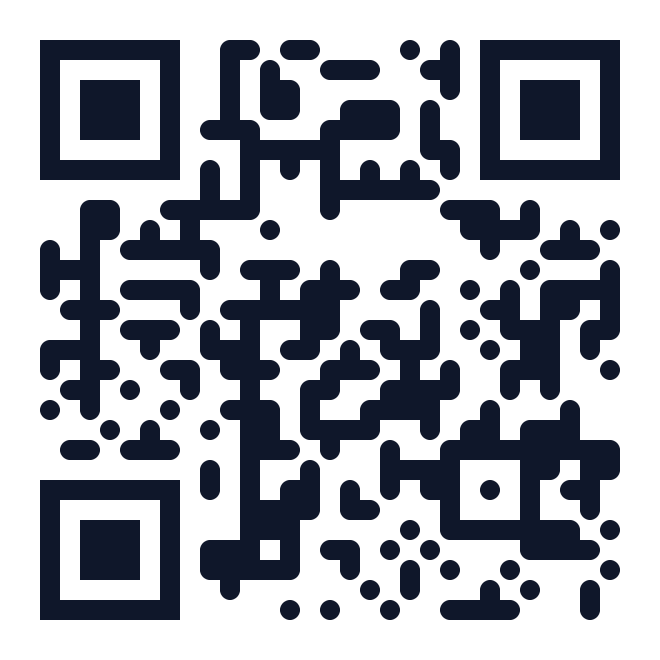

# RoboHire Sales Kit

> **For Partner Distribution** — Startup Founders & HR Leaders

---

## The Problem Every Growing Team Faces

Hiring is broken for startups. You're competing against companies with 10x your recruiting budget, but you don't have:

- A dedicated recruiter (founders are screening resumes at midnight)
- A trained interview panel (engineers pulled off product work to interview)
- An agency budget ($15-25K per hire through recruiters)
- Time to wait (42 days average time-to-hire while competitors move in 2 weeks)

**The result?** Great candidates slip away. Bad hires cost 3-6 months of runway. And your team spends 30% of their time on hiring instead of building.

---

## What is RoboHire?

RoboHire is an AI-powered recruiting platform that runs the first 80% of hiring autonomously — from role definition to candidate shortlist — so your team only focuses on the final decision.

**This is not another ATS dashboard.** RoboHire doesn't just store data — it moves the work forward.

> *"From role brief to final shortlist, hiring moves on autopilot."*

### Key Numbers

| Metric | Traditional Hiring | With RoboHire |
|---|---|---|
| Time-to-shortlist | 42 days | **3 days** |
| Screen 200 resumes | 3-5 days | **Minutes** |
| Interview scheduling | 2 weeks of back-and-forth | **48 hours, self-serve** |
| Evaluation consistency | Varies by interviewer | **Unified AI standard** |
| Availability | Business hours only | **24/7, 7 languages** |
| Cost per hire (agency) | $15,000-25,000 | **Starting at $29/month** |

---

## How It Works: 6 Steps to Your Next Great Hire

### Step 1: Clarify the Role
**AI Recruiting Consultant (Agent Alex)**

Talk to our AI recruiting consultant like you'd brief a senior recruiter. It asks the right questions — scope, must-have skills, seniority, compensation, team dynamics, deal-breakers — and produces a structured hiring brief in ~10 minutes.

*Replaces: Multiple kickoff meetings and email threads*

### Step 2: Generate Job Description
**AI JD Generator**

From your brief, RoboHire automatically drafts a polished job description with responsibilities, requirements, nice-to-haves, and benefits. Edit inline or let AI refine it further.

*Replaces: Hours of manual writing and repeated revisions*

### Step 3: Screen Resumes
**AI Smart Matching**

Upload your candidate pool — RoboHire uses semantic matching (not keyword search) to read context, assess skill relevance, evaluate experience depth, and identify upside potential. Every candidate gets a score, grade, and clear reasoning.

*Replaces: 3-5 days of manual resume review*

### Step 4: Invite Candidates
**Automated Interview Outreach**

Top candidates automatically receive interview invitations with a private link and QR code. No software install needed — candidates click and go. Self-serve scheduling eliminates calendar coordination.

*Replaces: Dozens of follow-up emails and scheduling headaches*

### Step 5: Conduct AI Interviews
**24/7 AI Video Interviewer**

Our AI interviewer conducts structured video conversations based on your role requirements — with intelligent follow-up questions that adapt in real-time. Available around the clock in 7 languages.

*Replaces: 2 weeks of calendar coordination + inconsistent panel interviews*

### Step 6: Review & Decide
**Multi-Dimensional Evaluation**

Every completed interview produces a structured assessment: skill fit score, experience depth analysis, strengths & weaknesses, risk signals, AI cheating detection, and a clear hiring recommendation. Your team reviews scorecards and makes the final call.

*Replaces: Scattered notes, subjective gut-feel evaluations*

---

## Why Startups Choose RoboHire

### 1. An AI Recruiting Team, Not Another Tool

Most hiring software stores information. RoboHire executes work. You're not buying a dashboard — you're adding recruiting capacity. Role definition, screening, interviews, evaluations — it all moves forward autonomously.

### 2. Semantic Intelligence, Not Keyword Matching

RoboHire reads context. It connects "3 years of ML projects" with "TensorFlow expertise." It identifies adjacent experience and true depth. During interviews, it asks intelligent follow-ups based on candidate answers — not a fixed script.

### 3. Consistent & Defensible

Every candidate goes through the same structured process. Same questions. Same rubric. Same scoring. No interviewer bias, no mood-dependent variation. Clear audit trail when stakeholders ask "why this person?"

### 4. Professional Hiring at Startup Costs

No recruiter salary. No agency fees. No trained interview panel required. Enterprise-grade hiring operations starting at $29/month. Scale from 5 to 100 hires annually without adding HR headcount.

---

## Real-World Scenario: Campus Recruiting

**The challenge:** 150 applicants for 4 engineering positions. Traditional approach = 3 weeks minimum.

| Timeline | What Happens |
|---|---|
| **Day 1 Morning** | Brief the role to AI. Upload 150 resumes. Receive ranked top 15 with detailed reasoning. |
| **Day 1 Afternoon** | All 15 candidates invited to AI interview. Self-serve scheduling — no coordination needed. |
| **Day 2-3** | 12 candidates complete interviews on their own schedule (evenings, weekends — AI is always available). |
| **Day 3 Evening** | 4 finalists identified with structured scorecards. Ready for founder final interviews. |

**Result:** 3 days instead of 3 weeks. Zero recruiter hours. Consistent evaluation for every candidate.

> *"During campus hiring, volume is brutal and interviewer quality can vary a lot. With RoboHire, every candidate gets the same core questions, the scoring is consistent, and our team gets a much clearer read on intent and soft skills."*
> — Head of HR, Consumer Internet Company

---

## Built for Global Teams

### 7 Languages Supported
Chinese, English, Japanese, Spanish, French, Portuguese, German

### 24/7 Availability
Candidates interview on their schedule — across every time zone. No more "sorry, our interviewer is only available Tuesday 2-4pm Beijing time."

### Unified Standards
Whether you're hiring in Tokyo, Berlin, or San Francisco, every candidate is evaluated on the same rubric. Cross-region comparisons are fair and consistent.

---

## Pricing

### Starter — CNY ¥179/month (was ¥199)
For individuals and small teams getting started.
- 1 seat, 3 job roles
- 15 interviews / month
- 30 resume matches / month
- Interview evaluation & summary

### Growth — CNY ¥1,232/month (was ¥1,369)
For growing teams with multiple openings.
- Unlimited seats & job roles
- 120 interviews / month
- 240 resume matches / month
- All Starter features + RoboHire API integration
- 6 interview languages, language assessment
- Email support

### Business — CNY ¥2,474/month (was ¥2,749) — Most Popular
For large teams scaling fast.
- Unlimited seats & job roles
- **300 interviews / month**
- **1,000 resume matches / month**
- All Growth features
- Priority support, advanced analytics
- White-label interview reports
- Full interview video playback
- Cheating detection

### Enterprise — Custom
For high-volume organizations.
- Everything unlimited
- Custom workflows, 45+ ATS integrations
- Custom interview voice
- Dedicated account manager & support

**All plans include a 14-day free trial — no credit card required.**

> Scan the QR code or visit **robohire.io** to get started.
>
> 

---

## Feature Highlights

### Talent Hub
Centralized candidate database with smart tagging, advanced search, and AI-powered insights. Every resume parsed and enriched automatically. Build your talent pipeline — not just fill today's role.

### Smart Matching
Upload resumes against any job. AI scores and ranks candidates across multiple dimensions: skill fit, experience depth, potential, and culture alignment. Batch process hundreds of candidates simultaneously.

### AI Video Interviews
Structured conversations powered by Google Gemini. Real-time adaptation. Cheating detection built in. Candidates need zero software — just a browser and camera. Available 24/7 in 7 languages.

### Agent Alex — AI Recruiting Consultant
Your always-available recruiting partner. Supports text chat and live voice conversation. Helps clarify requirements, draft JDs, and build structured hiring briefs. Sessions are saved and shareable with your team.

### Analytics Dashboard
Track hiring pipeline metrics: time-to-hire, candidate conversion rates, score distributions, interview completion rates. Data-driven decisions, not guesswork.

### ATS Integrations
Connect with existing applicant tracking systems. Webhook support for real-time data sync. API access for custom workflows.

---

## ROI Calculator

### For a 20-Person Startup Hiring 10 People/Year

| Cost Category | Without RoboHire | With RoboHire |
|---|---|---|
| Recruiter salary (part-time) | $30,000/year | $0 |
| Agency fees (3 hires) | $45,000/year | $0 |
| Founder time (200 hrs screening) | $50,000 opportunity cost | $5,000 (20 hrs) |
| Interview coordination | 100 hrs/year | ~10 hrs/year |
| **RoboHire subscription** | — | **$2,388/year** |
| **Total** | **$125,000+** | **$7,388** |
| **Savings** | — | **$117,000+/year** |

*Assumptions: Founder time valued at $250/hr. Agency fee at $15K per placement. RoboHire Growth plan at $199/month.*

---

## Security & Compliance

- **Data encryption** at rest and in transit (AES-256, TLS 1.3)
- **GDPR-ready** data handling and candidate consent workflows
- **SOC 2 aligned** security practices
- **Data residency** options for enterprise customers
- **Candidate data retention** policies with automatic purging
- **No candidate data used for AI training** — your data stays yours

---

## Getting Started

### 3 Minutes to Your First AI Interview

1. **Sign up** at [robohire.io](https://robohire.io) — free 14-day trial, no credit card
2. **Brief the role** — Talk to Agent Alex or create a job manually
3. **Upload resumes** — Drag and drop, bulk upload supported
4. **Review matches** — AI scores and ranks candidates instantly
5. **Send invitations** — One click to invite top candidates to AI interview
6. **Review scorecards** — Structured evaluations ready for your team's final decision

### Partner Resources

- **Product demo**: Schedule at [robohire.io](https://robohire.io)
- **Partner portal**: Contact your account manager for co-branded materials
- **API documentation**: Available at [robohire.io/docs](https://robohire.io/docs)
- **Support**: support@robohire.io

---

## FAQ for Startup Founders

**Q: Can AI really interview candidates well?**
A: RoboHire's AI interviewer conducts structured conversations with real-time follow-up questions — not a rigid script. It evaluates technical knowledge, communication skills, and problem-solving ability. Studies show 90%+ alignment with human interviewer assessments.

**Q: Will candidates feel uncomfortable talking to AI?**
A: Candidate feedback has been overwhelmingly positive. Many prefer it — no scheduling pressure, no interviewer intimidation, and they can interview at their most comfortable time (even 11pm on a Sunday).

**Q: What about bias?**
A: AI evaluation removes human biases: no halo effect, no recency bias, no mood-dependent scoring. Every candidate gets the same questions and the same rubric. The evaluation is based purely on demonstrated competency.

**Q: Is it only for tech hiring?**
A: No. RoboHire works for any role where structured interviews matter — engineering, product, marketing, operations, sales, customer success. The AI adapts its questions and evaluation criteria to each role's requirements.

**Q: Can I still do human interviews?**
A: Absolutely. RoboHire handles the first round — screening and structured evaluation. Your team focuses on the final round: culture fit, team dynamics, and the human judgment that matters most.

**Q: What if I only hire 2-3 people per year?**
A: The Starter plan at $29/month is designed exactly for this. Even at low volume, you save dozens of hours per hire and get significantly better candidate evaluation than ad-hoc interviews.

---

## Contact

**RoboHire** — AI-Powered Recruiting for Modern Teams

Website: [robohire.io](https://robohire.io)
Email: support@robohire.io

*Let AI handle the repetitive 80%. Keep your team focused on what humans do best: reading nuance, testing fit, and making the final call.*
